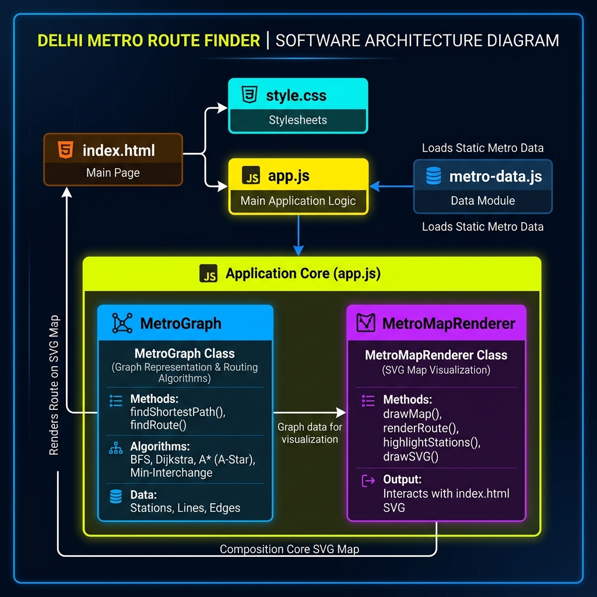
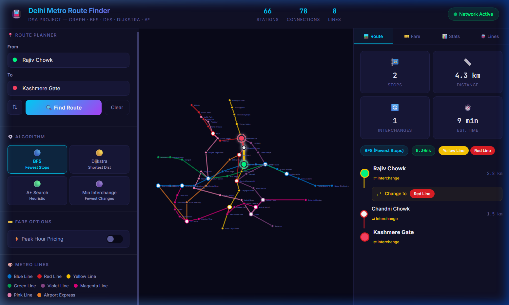

# 🚇 Delhi Metro Route Finder

A premium standalone Web application modeling the Delhi Metro network as an undirected graph. It allows users to search for the shortest paths, calculate fares, view network analytics, and explore route combinations using different pathfinding algorithms on an interactive schematic SVG map.

---

## 📂 Project Structure

```text
MetroRouteFinder/
├── web/                      # Web UI Source Files
│   ├── index.html            # Core layout with SVG schematic map
│   ├── style.css             # Premium glassmorphic dark theme stylesheet
│   ├── app.js                # JS Graph logic, algorithms, map rendering, UI handlers
│   └── metro-data.js         # Full Delhi Metro network node coordinates & line definitions
│
└── README.md                 # Project documentation (this file)
```

---

## 📊 Project Architecture Graph



---

## 📸 Application Screenshot



---

## 🚀 Running the Project

### Web-Based Interactive UI
1. Navigate to the `web` folder.
2. Open `index.html` in any modern web browser, or serve it using a local HTTP server:
   ```bash
   cd web
   python -m http.server 8080
   ```
3. Open `http://localhost:8080` in your browser.
4. Select a source and destination by typing in the search box or clicking directly on the SVG map nodes.
5. Pick your pathfinding algorithm (**BFS, Dijkstra, A*, or Min-Interchange**) to visualize the route!

---

## 🛠️ Features Included
- **Schematic SVG Map**: An interactive map illustrating 8 lines and 66 stations with relative position layout coordinates.
- **Multiple Graph Algorithms**: BFS (Fewest stops), Dijkstra (Shortest distance), A* (Heuristic search), and Minimum Interchange (Fewest line transfers).
- **Interactive Map Selection**: Click nodes directly on the map to set source and destination stations.
- **Autocomplete Suggestions**: Quick search box dropdowns with matching line indicator dots.
- **Fare Calculator Dashboard**: Real-time fare breakdown including base fare, distance rates, line transfer surcharges, and peak-hour toggle.
- **Network Statistics Dashboard**: Detailed insights covering degree distribution graph, interchange list, and connectivity checks.
